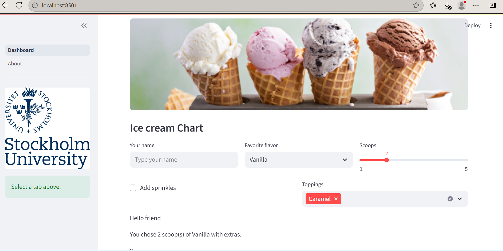
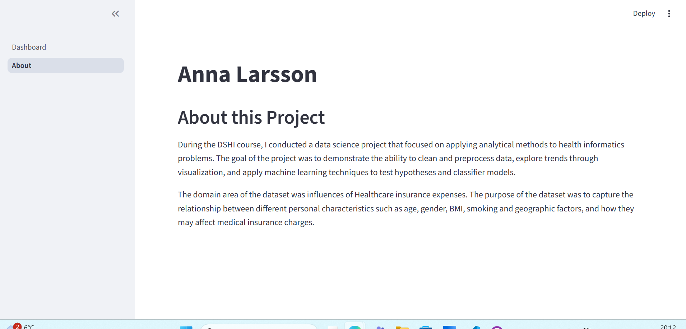

# PROHI Dashboard Example

**Author**: Anna Larsson
<!-- As main author, do not write anything in the line below.
The collaborator will edit the line below in GitHub -->
**Contributor:** Pratibha Rustogi 

_Note that this file is written in **MarkDown** language. A reference is available here: <https://www.markdownguide.org/basic-syntax/>_


## Introduction

This template project will contain a simple interactive web dashboard with Streamlit.

## System description

 This repository contains a two-page Streamlit web dashboard developed as part of the PROHI course. The app demonstrates an organized dashboard layout with input widgets, synthetic data, and charts, as well as an About page summarizing the course project.


- **Dashboard page:**  
  - "Ice Cream Chart"
  - Three interactive input widgets (selectbox, slider, multiple choice)  
  - A chart showing a Happiness Score 
  - A data table with synthetic data, displaying Flavours statistic. 
  


- **About page:**  
  - Displays my name  
  - Contains a 100–150 word Markdown summary describing the DSHI project.



- **Git Commit Examples:**


### Installation of libraries

Run the commands below in a terminal to configure the project and install the package dependencies for the first time.

If you are using Mac, you may need to install Xcode. Check the official Streamlit documentation [here](https://docs.streamlit.io/get-started/installation/command-line#prerequisites).

1. Create the environment with `python -m venv env`
2. Activate the virtual environment for Python
   - If using Mac or Linux, type the command: `source env/bin/activate` 
   - If using Windows:
   - First, [set the Default Terminal Profile to CMD Terminal](https://code.visualstudio.com/docs/terminal/profiles)
   - Then, type in the CMD terminal: `.\env\Scripts\activate.bat`
3. Make sure that your terminal is in the environment (`env`) not in the global Python installation. The terminal should start with the word `env`
4. Install required packages `pip install -r ./requirements.txt`
5. Check that the installation works running `streamlit hello`
6. Stop the terminal by pressing **Ctrl+C**

### Execute custom Dashboard

First, make sure that you are running Python from the environment. Check the steps 2 and 3 above. Then, to run the custom dashboard execute the following command:

```
> streamlit run Dashboard.py
# If the command above fails, use:
> python -m streamlit run Dashboard.py
```

### Dependencies

Tested on Python 3.12.7 with the following packages:
  - Jupyter v1.1.1
  - Streamlit v1.46.1
  - Seaborn v0.13.2
  - Plotly v6.2.0
  - Scikit-Learn v1.7.0
  - shap v0.48.0

## Contributors


Anna Larsson, anla8121@student.su.se.